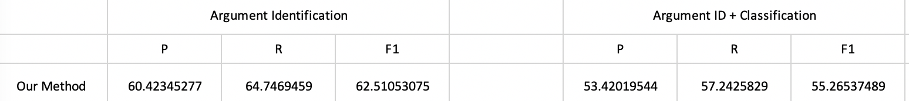

### 运行的环境
```
python==3.7.4
pytorch==1.3.1
pytorch-crf==0.7.2
pytorch-transformers==1.2.0
```
或
```
pip install -r requirements.txt
```

### Train
```
bash run.sh
```

### Test
修改 run.sh 中的参数 

    --do-test True

然后

```
bash run.sh
python test_mine.py
```

## 思路

将事件抽取（Event Extraction）任务中的论元抽取（Argument Extraction）任务任务建模成一个序列标注任务。

实现了一种 Bert-BiLSTM-CRF 方法

在训练过程中添加额外约束限制 Bert 上下文表示关注事件信息（事件类型、触发词）

## 数据构造

将句子及其Gold Label构造成标准的 BIO 序列标注数据，并为事件类型（Personnel End-Position）以及触发词（Former）添加特殊标注标签（Event）

```
Personnel	Event
End-Position	Event
Former	Event
senior	O
banker	O
Callum	B-Person
McCarthy	I-Person
begins	O
what	O
is	O
one	O
of	O
the	O
most	O
important	O
jobs	O
in	O
London	O
's	O
financial	O
world	O
in	O
September	O
,	O
when	O
incumbent	O
Howard	O
Davies	O
steps	O
down	O
.	O
```

## 实验结果

