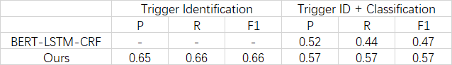
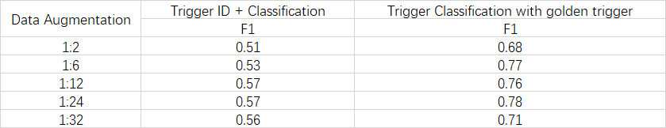

# EEPipline
## Idea
基础Baseline为直接将事件提取任务的两阶段触发器提取（Trigger Extraction）和论元提取（Argument Extraction）分别重新建模成为两个序列标注任务。

但是由于ACE2005数据集的规模较小，而事件类别种类数目不多，直接建模成为序列标注任务会导致每个类别的样本数目过少。

本方法将触发器提取任务划分为两阶段，通过序列标注识别触发器，通过二分类判断触发器对应的事件类型，不仅能够解决每个类别样本数目过少的问题，同时能够利用事件类型本身的信息。
## Task
### Task 1: Trigger Identification
将触发器识别（Trigger Identification）任务重新建模成为序列标注任务（Sequence Labeling）。

模型结构为BERT-BiLSTM-CRF。
### Task 2：Trigger Classification
将触发器分类（Trigger Classification）任务重新建模成为二分类任务。

模型结构为BERT + a linear layer。

将每个事件类型编码到句子当中，逐个判断触发器属于该事件类型是否成立，能够充分利用事件类型本身的信息。

除此之外，该思路还具有较强的拓展性，比如可以将事件类型的guideline、事件类型的论元也编码到句子当中，使得信息更加丰富。因为时间原因，没有展开进行该实验。
## Train
### Data Preprocess
```shell script
python3 data_preprocess.py
```
文件 "tri_id_train/dev/test.txt" 为任务一（触发器识别）的训练以及测试语料。其格式为：

    He lost an election to a dead man . |||O O O B-TRI O O O O O 

文件 "tr_cls_train/dev/test.txt" 为任务二（触发器分类）的训练以及测试语料。其格式为：

    [CLS] trigger word , <pos> begin_pos end_pos </pos> , event_type [SEP] sentence [SEP]
### Trigger Identification
```shell script
python3 tri_id.py --do-train True
```
模型保留位置："./result/cur_time + '--epoch:{}'.format(epoch)"
### Trigger Classification
```shell script
python3 tri_cls.py --do-train True
```
模型保留位置："./result/'tri-cls--epoch:{}'.format(epoch)"

## Test
查看模型在测试集上的运行结果。
### Trigger Identification
```shell script
python3 tri_id.py --do-eval True
```
触发器识别结果保留位置：config.tri_id_result_file

触发器识别结果格式：

    He lost an election to a dead man . |||O O O B-TRI O O O O O 
### Trigger Classification
```shell script
python3 tri_cls.py --do-eval True
```
触发器事件类型识别结果保留位置：config.tri_cls_result_file

触发器事件类型识别结果格式：

    event_type trigger_begin_pos trigger_end_pos, ...
## Run
识别句子中的触发器及其对应的事件类型。
```shell script
python3 main.py
```
若想要进行单句的识别，需要将 config.input_file 和 config.gold_trigger_file 设置为 None；

若想要进行文档的识别，需要将 config.input_file 设置成为输入文档的位置，文档格式为：每行一句话。

若想要进行文档识别结果的评估，需要将 config.gold_trigger_file 设置成为正确结果文档的位置，文档格式为：每行为一句话对应的触发器三元组。

## Result

表格一为本方法的实验结果与直接使用BERT-LSTM-CRF的实验结果进行序列标注进行比较。



表格二为构造Trigger Classification的训练数据集时，正样本与负样本不同构造比例对应的实验结果。




## Trained Model
链接: https://pan.baidu.com/s/1eMApiEmgIYwvlQBvzIgLLg 提取码: v7aw 